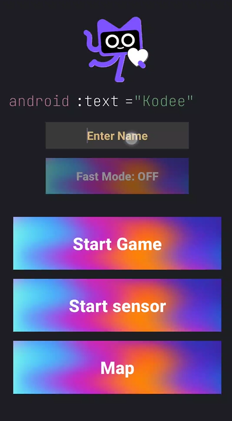
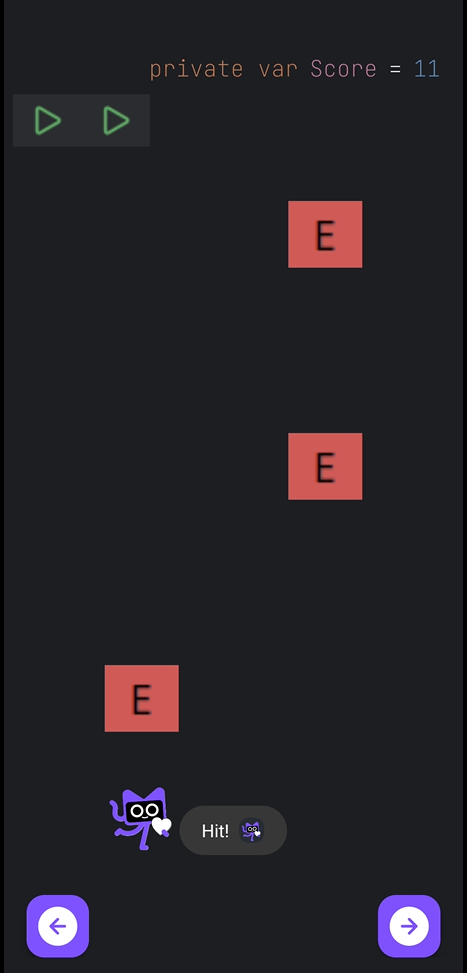
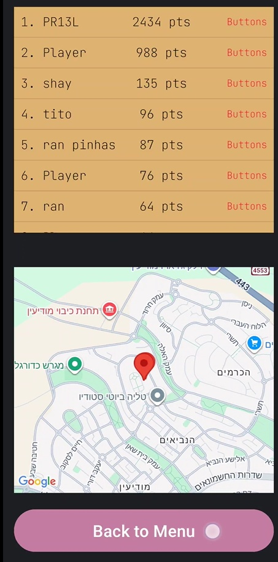

# Kodee Run - The IDE Survivor

> "Help Kodee survive the infinite loop of errors!"

Kodee Run is a unique Android arcade game entirely designed to look and feel like the Android Studio IDE. You play as Kodee (the Kotlin mascot), dodging falling Syntax Errors and collecting Kotlin logos on a 5-lane road.

The game combines classic dodging mechanics with a "Meta" design style, featuring code-syntax typography, dark mode UI, and sensor-based controls.

---

## Screenshots

| Main Menu | Gameplay |
|:---:|:---:|
|  |  |
| IDE-styled Menu with Sensor/Button toggle | Kodee dodging 'E' errors on a 5-lane grid |

| Game Over | Leaderboard & Map |
|:---:|:---:|
|  |  |
| Score summary in code syntax | Top scores & location tracking |

---

## Game Features

* IDE Themed UI: The entire interface mimics the colors, fonts (JetBrains Mono), and layout of Android Studio code editors.
* Character: Play as Kodee, the beloved Kotlin mascot.
* Enemies: Dodge the red "E" Blocks (Errors) that fall from the top. Hitting one will cost you a life!
* Collectibles: Grab the Kotlin Logos to boost your score.
* Dynamic Grid: A wider 5-lane road allowing for complex dodging patterns.
* Audio: Immersive background music and "Crash" sound effects upon collision.
* Location Integration: Your high score is saved with your real-world location, displayed on an integrated Google Map in the leaderboard.

---

## Controls & Modes

The game features a flexible control system tailored to your preference:

### 1. Button Mode (Classic)
* Use the Left (<) and Right (>) arrows on the screen to switch lanes.
* Fast Mode: Toggle "Fast Mode" in the menu to increase game speed (x1.5) for a harder challenge.

### 2. Sensor Mode (Immersive)
* Tilt Control: Tilt your device Left or Right to move Kodee across the lanes.

---

## Tech Stack

* Language: Kotlin
* Environment: Android Studio
* UI: XML Layouts (Relative & Linear Layouts)
* Sensors: Android Accelerometer & Gyroscope
* APIs: Google Maps SDK (for location-based leaderboards)
* Storage: SharedPreferences & Gson (for saving local high scores)

---

## Developer

Developed by Ran Pinhas
Computer Science Student @ Afeka College of Engineering

---
